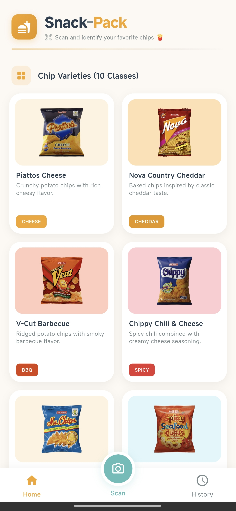
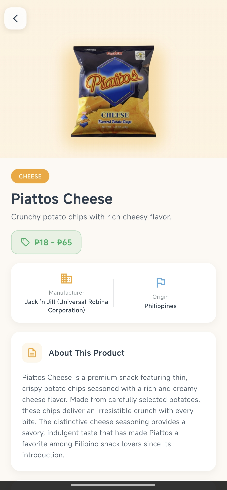
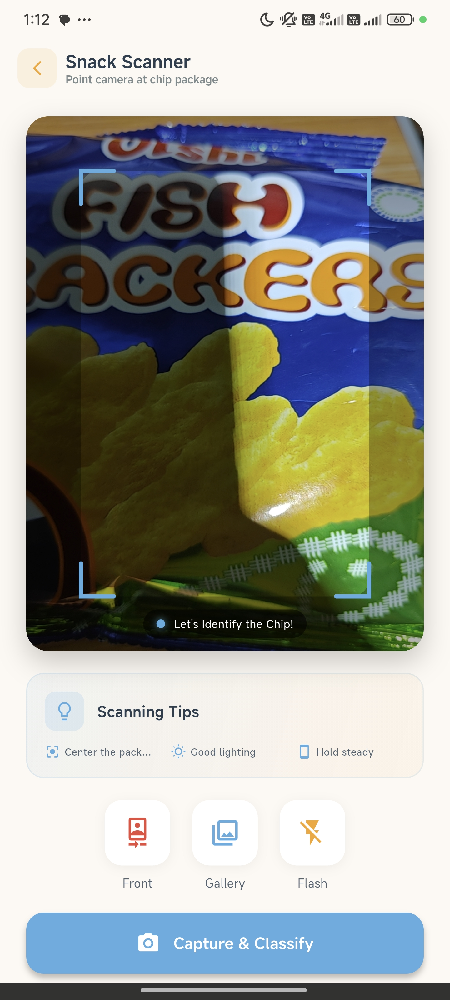
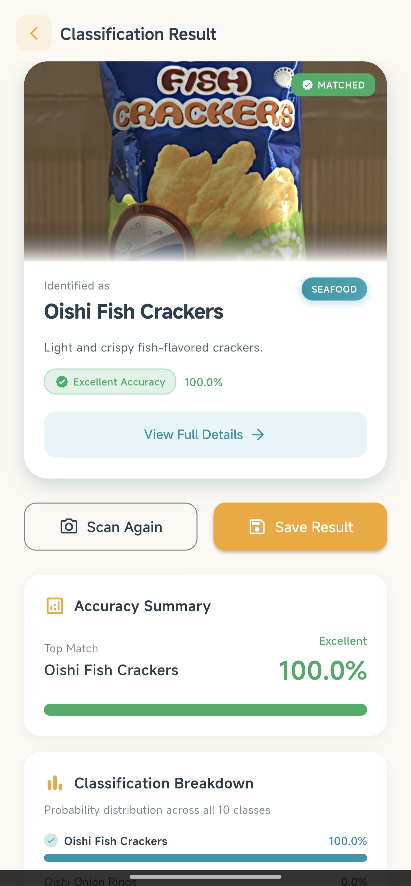
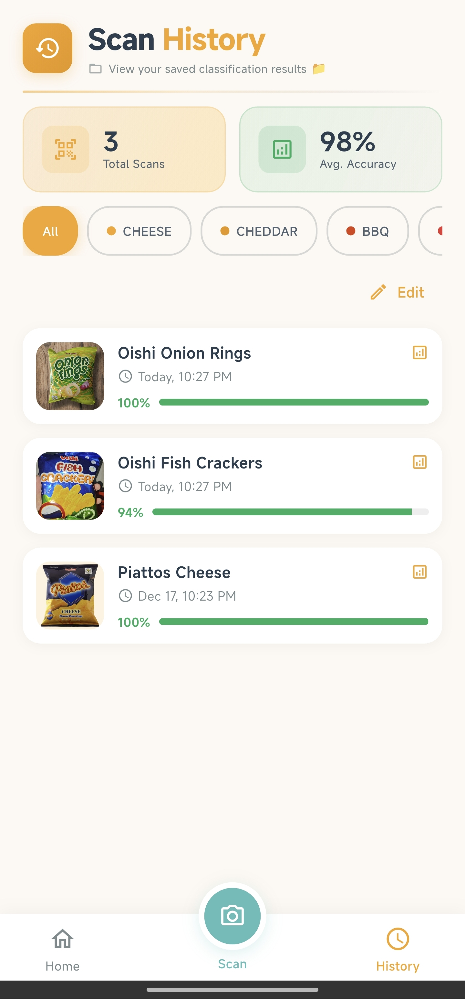

# IT120 | Final Project: Mobile Image Classification App

  

---

## Project Overview

This project demonstrates the implementation of a mobile image classification system that can identify 10 different chip varieties using a trained TensorFlow Lite model. The app features real-time camera scanning, classification history, and detailed information about each chip variety.

---

## Classification Categories

The application can identify the following 10 chip varieties:

<table>
<tr>
<td align="center" width="200">
 
<b>Chippy Chili & Cheese</b>
</td>
<td align="center" width="200">
 
<b>Clover Chips Ham & Cheese</b>
</td>
<td align="center" width="200">
 
<b>Mr. Chips Corn & Cheese</b>
</td>
<td align="center" width="200">
 
<b>Nova Country Cheddar</b>
</td>
<td align="center" width="200">
 
<b>Oishi Cracklings Salt & Vinegar</b>
</td>
</tr>
<tr>
<td align="center" width="200">
 
<b>Oishi Fish Crackers</b>
</td>
<td align="center" width="200">
 
<b>Oishi Onion Rings</b>
</td>
<td align="center" width="200">
 
<b>Oishi Spicy Seafood Curls</b>
</td>
<td align="center" width="200">
 
<b>Piattos Cheese</b>
</td>
<td align="center" width="200">
 
<b>V-Cut Barbecue</b>
</td>
</tr>
</table>

---

## Student Information

**Student Name:** Beltran, Michael James

**Course:** IT120 - Mobile Application Development

**Project:** Final Project - Snack Pack Image Classification App

---

## Application Screenshots

<table>
<tr>
<td align="center">
 
<b>Home Page</b> 
<em>Main landing page with navigation options</em>
</td>
<td align="center">
 
<b>Class Details</b> 
<em>Detailed information about each chip variety</em>
</td>
<td align="center">
 
<b>Scan Page</b> 
<em>Real-time camera scanning interface</em>
</td>
</tr>
<tr>
<td align="center">
 
<b>Classification Result</b> 
<em>AI-powered classification results with confidence scores</em>
</td>
<td align="center">
 
<b>Scan History</b> 
<em>Historical record of all scanned items</em>
</td>
</tr>
</table>

---

## Project Source Code

<table>
<tr>
<td align="center" width="800">
 

  
<h3>Snack-Pack-App</h3>

<em>Complete Flutter application source code with TensorFlow Lite integration</em>

 

  
</td>
</tr>
</table>

---

## Related IT120 Course Projects

<table>
<tr>
<td align="center" width="260">
 

  
<h4>Final Project</h4>

Snack Pack Chips Varieties Classification

 

  
</td>
<td align="center" width="260">
 

  
<h4>Widget Components</h4>

Flutter Widget & UI Design Patterns

 

  
</td>
<td align="center" width="260">
 

  
<h4>Activity 1</h4>

Introduction to Mobile Development

 

  
</td>
</tr>
</table>

---

## Developer Profile

<table>
<tr>
<td align="center" width="400">
 

  
<h3>Connect With Me</h3>

<em>Explore more of my projects and contributions</em>

 

  
</td>
</tr>
</table>

---

## Technologies Used

<table>
<tr>
<td align="center" width="150">
 
<b>Flutter</b> 
Cross-platform mobile framework
</td>
<td align="center" width="150">
 
<b>Dart</b> 
Programming language
</td>
<td align="center" width="150">
 
<b>TensorFlow Lite</b> 
ML model inference
</td>
<td align="center" width="150">
 
<b>Android SDK</b> 
Mobile platform
</td>
<td align="center" width="150">
 
<b>Python</b> 
Model training
</td>
</tr>
</table>

---

## Features

✅ Real-time image classification using camera  
✅ 10 distinct chip variety recognition  
✅ Confidence score display  
✅ Scan history tracking  
✅ Detailed class information pages  
✅ User-friendly interface  
✅ Offline ML model execution  

---

**© 2024 Michael James Beltran | IT120 Final Project**

*Built with ❤️ using Flutter and TensorFlow Lite*

