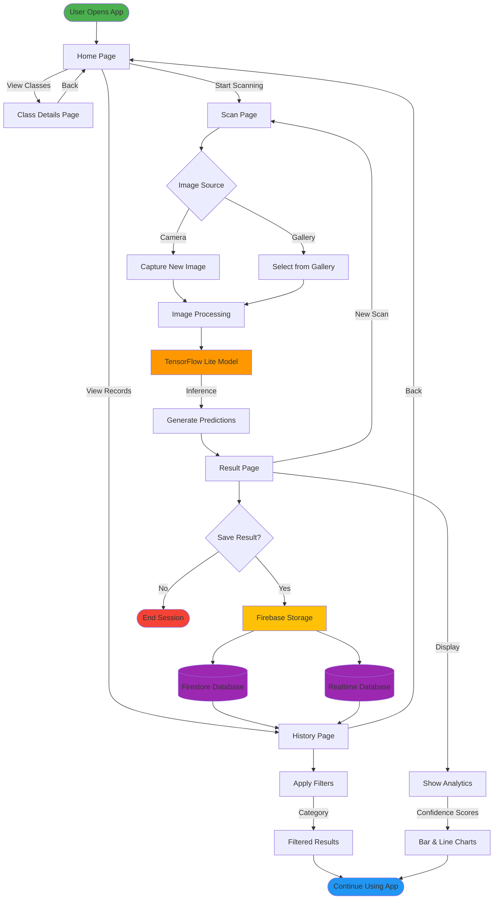
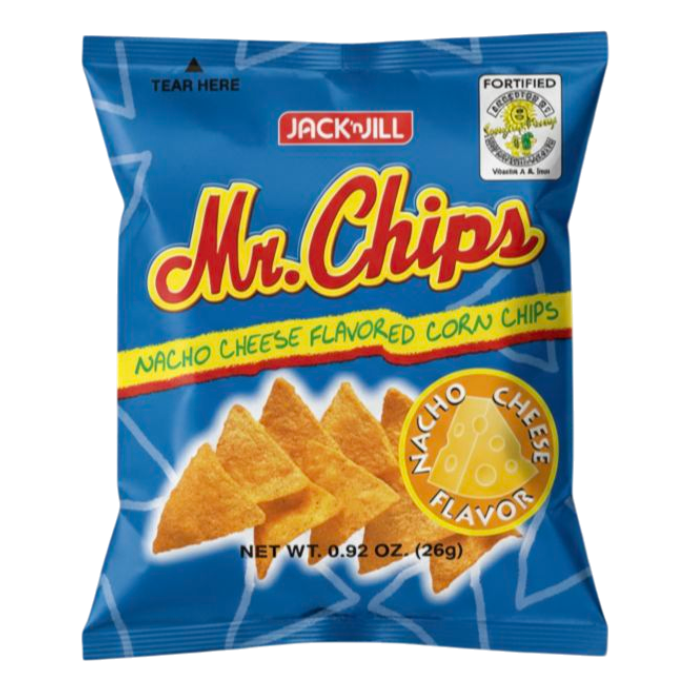
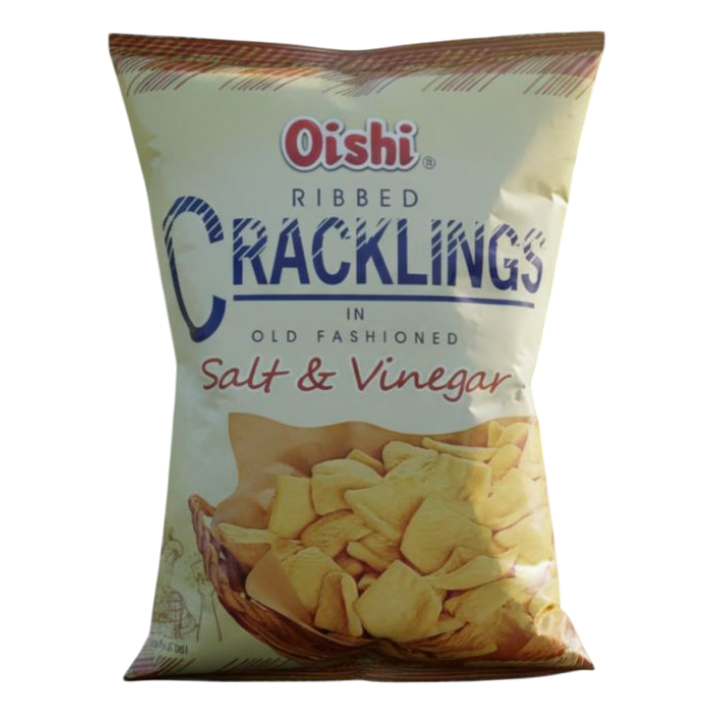
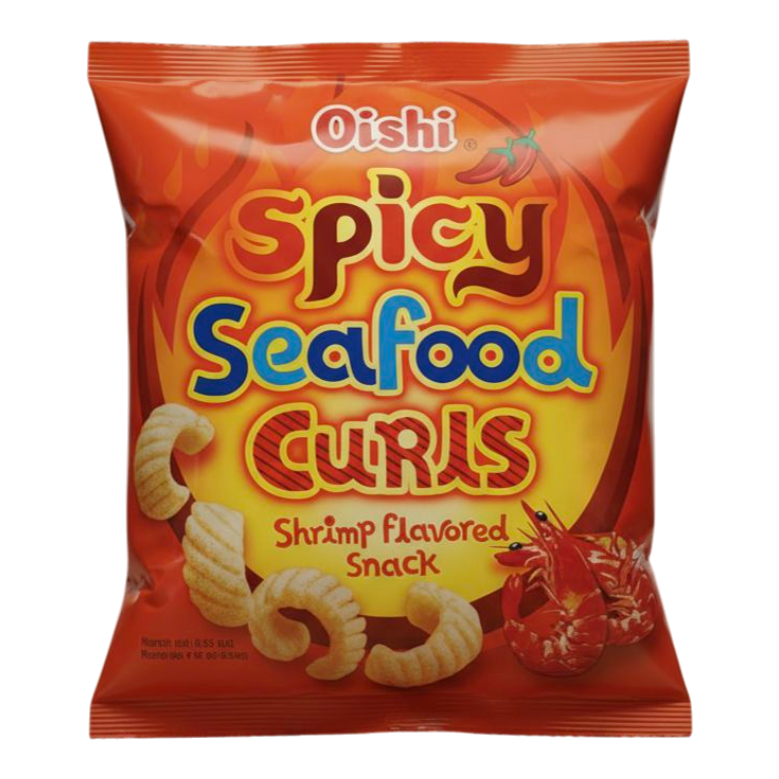
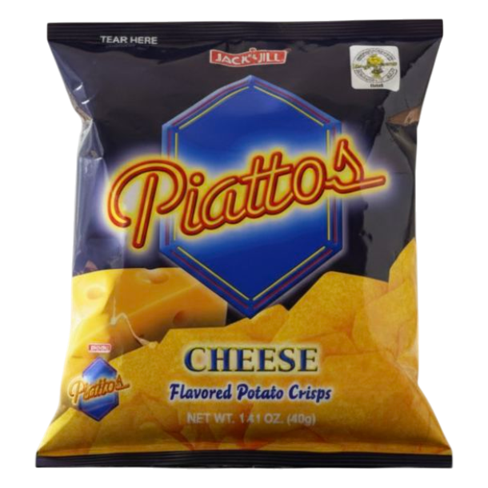
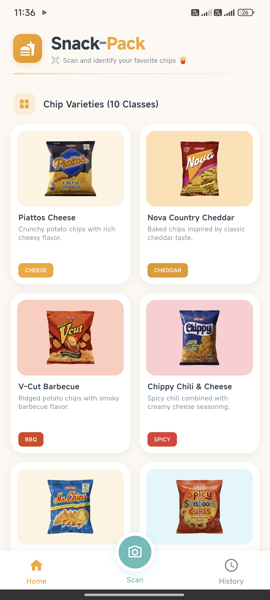
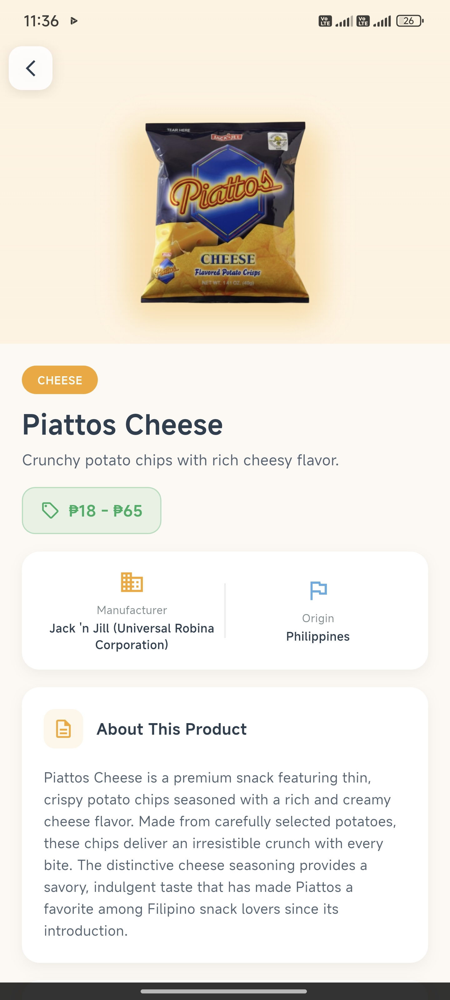
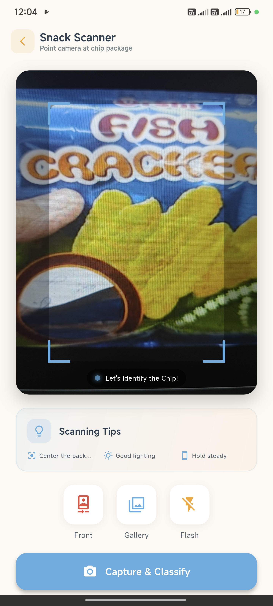
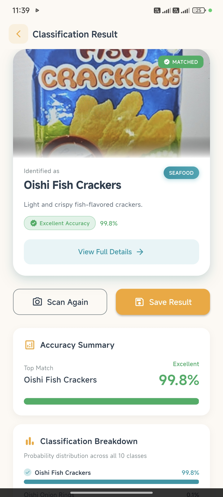
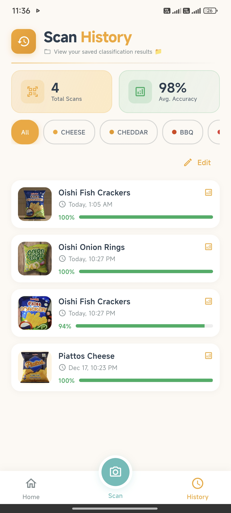

# IT120 | Final Project: Mobile Image Classification App

  

---

## Project Overview

**Snack-Pack App** is a mobile image classification application built with **Flutter** that leverages **TensorFlow Lite** machine learning to identify and classify **10 different varieties of popular snack chips** in real-time.

The app allows users to scan chip packages using their device camera or select images from their gallery. Once scanned, the trained ML model processes the image and returns a prediction with a confidence score. Results are displayed with detailed analytics including bar graphs and line charts, and can be saved to Firebase for history tracking.

---

## Application Flow

<b>View Detailed Workflow Steps</b>

 

### User Journey

<table>
<tr>
<td align="center" width="20%">

<h4>Step 1</h4>
<b>Launch Application</b> 
User opens the app and navigates to the scan page
</td>
<td align="center" width="20%">

<h4>Step 2</h4>
<b>Capture Image</b> 
Take a photo or select from gallery
</td>
<td align="center" width="20%">

<h4>Step 3</h4>
<b>Process & Classify</b> 
ML model analyzes the image
</td>
<td align="center" width="20%">

<h4>Step 4</h4>
<b>View Results</b> 
See predictions with analytics
</td>
<td align="center" width="20%">

<h4>Step 5</h4>
<b>Save & Track</b> 
Store results in Firebase for history
</td>
</tr>
</table>

---

## Classification Categories

The application can identify the following **10 chip varieties**:

<table>
<tr>
<td align="center" width="180">
 
<b>Chippy Chili & Cheese</b>
</td>
<td align="center" width="180">
 
<b>Clover Chips</b>
</td>
<td align="center" width="180">
 
<b>Mr. Chips Corn & Cheese</b>
</td>
<td align="center" width="180">
 
<b>Nova Country Cheddar</b>
</td>
<td align="center" width="180">
 
<b>Oishi Cracklings</b>
</td>
</tr>
<tr>
<td align="center" width="180">
 
<b>Oishi Fish Crackers</b>
</td>
<td align="center" width="180">
 
<b>Oishi Onion Rings</b>
</td>
<td align="center" width="180">
 
<b>Oishi Spicy Seafood Curls</b>
</td>
<td align="center" width="180">
 
<b>Piattos Cheese</b>
</td>
<td align="center" width="180">
 
<b>V-Cut Barbecue</b>
</td>
</tr>
</table>

---

## Student Information

**Student Name:** Beltran, Michael James

**Course:** IT120 - Integrative Programming and Technologies 2

**Project:** Final Project - Snack Pack Image Classification App

---

##  Application Screenshots

<table>
<tr>
<td align="center">
<b>Home Page</b> 

</td>
<td align="center">
<b>Class Details</b> 

</td>
<td align="center">
<b>Scan Page</b> 

</td>
<td align="center">
<b>Scan Result</b> 

</td>
<td align="center">
<b>Scan History</b> 

</td>
</tr>
</table>

---

## Project Source Code

<table>
<tr>
<td align="center" width="800">
 

  
<h3>Snack-Pack-App</h3>

<em>Complete Flutter application source code.</em>

 

  
</td>
</tr>
</table>

---

## Related IT120 Course Projects

<table>
<tr>
<td align="center" width="260">
 

  
<h4>Snack-Pack Classification</h4>

ML model for Snack Pack chip classification.

 

  
</td>
<td align="center" width="260">
 

  
<h4>Widget Components</h4>

Flutter Widget & UI Design Patterns Activity

 

  
</td>
<td align="center" width="260">
 

  
<h4>IT120 Activity 1</h4>

Git & GitHub Activity

 

  
</td>
</tr>
</table>

---

##  Developer Profile

<table>
<tr>
<td align="center" width="400">
 

  
<h3>Connect With Me</h3>

<em>Explore more of my projects and contributions</em>

 

  
</td>
</tr>
</table>

---

## Technologies Used

<table>
<tr>
<td align="center" width="120">
 
<b>Flutter</b>
</td>
<td align="center" width="120">
 
<b>Dart</b>
</td>
<td align="center" width="120">
 
<b>TensorFlow Lite</b>
</td>
<td align="center" width="120">
 
<b>Firebase</b>
</td>
<td align="center" width="120">
 
<b>Android SDK</b>
</td>
<td align="center" width="120">
 
<b>Android Studio</b>
</td>
<td align="center" width="120">
 
<b>Python</b>
</td>
<td align="center" width="120">
 
<b>Material Design</b>
</td>
</tr>
</table>

---

